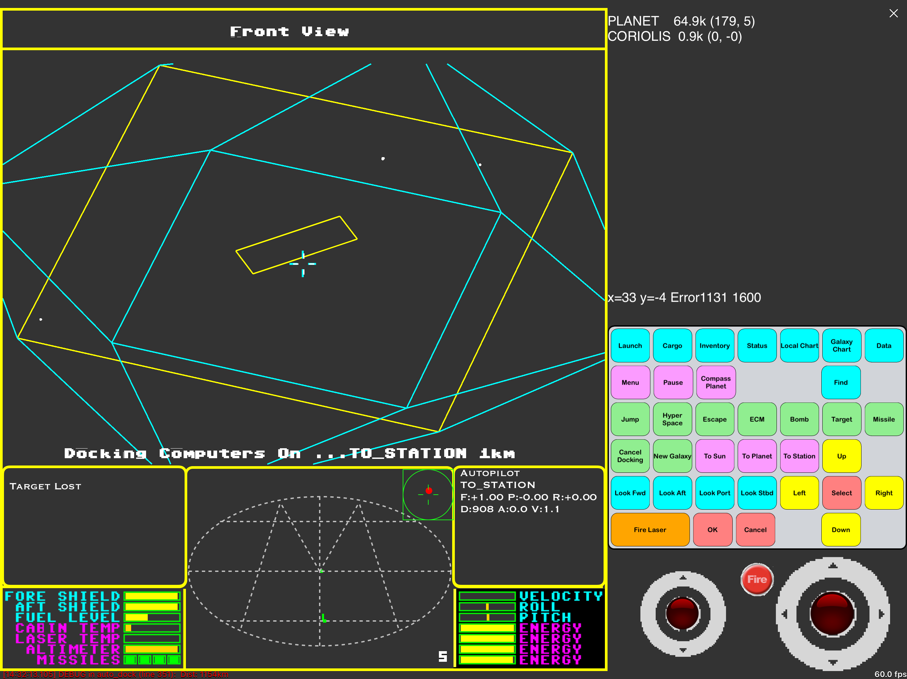

This is a Pythonista re-creation of the classic game Elite, originally
released for the BBC Micro in 1984 and subsequently on various other
platforms.

This was inspired by Mark Moxon's deconstruction and documentation of the
original 6502 Assembler  https://elite.bbcelite.com

There are multiple sources of information and gameplay available on the
web and YouTube, e.g. https://wiki.alioth.net/index.php/Main_Page
Search 'BBC Elite' on YouTube

I wondered if AI would be able to convert this code to Python, and Mark suggested
that I convert a C version from 2002 by Christian Pinder. https://www.christianpinder.com/games/

There were, however, some challenges:
1. The game was designed around keypresses on a BBC keyboard, with function keys etc
   Using the normal Ipad onscreen keyboard, which covers half the screen was not
   attractive.
2. With no mouse input, cursor movement was by cursor keys
3. In Pythonista on the Ipad, the Scene module is the loop controller, updating and
   drawing under its own timing. Elite's assembler was its own controller.
4. For the code to live in several Python modules, I wanted to avoid global
   variables wherever possible. Hence the code would be refactored into classes.
   
5. To use ships comprised of coloured faces, as opposed to wireframe, would *Probably*
    require the use of SceneKit, which changes the complexity. Maybe for another day.

Many of the c files have been autoconverted to python by Google Gemini and Claude Sonnet 4.6
The graphics, keyboard input and joystick input will be provided by custom code
scanner, compass and hud are handled by custom code also
text output is also handled

As far as possible, the converted code is used for ship, player and flight logic
The intention is to keep the game as faithful to the original as possible
within limitations of the iPad

Having said that, I could not resist adding new features ;)

Each module is constructed as a class to avoid lots of globals
significant changes:

1. keyboard is replaced by an onscreen bespoke keyboard with labels instead of single letters
   The keyboard keys are reconfigured depending on mode
   
2. 2 joysticks, one for roll, pitch, the other for thrust
   Thrust is direct and will stay set when not touched.
   It will react when thrust is controlled by autopilot.
   Roll/Pitch has square law response, allowing finer control for lower deflection
   Thrust has cubic response, allowing slow speed control for docking
   Fire button fires whenever held, so can continuously fire.
    
3. Screen can be varied. Hud left and right sections are fixed size. Scanner width changes with screen size
   flight window fills screen. Watch out if original code uses fixed window
   
4. Sound is only controlled by device voume. it was not worth dedicating buttons to volume control

5. Graphics are handled by a combination of SpriteNodes for fixed items , and scene drawing for line drawing

6. Load and save use a json file, which makes it human readable (and editable ;)
   This of course allows the possibility to cheat. But of course you wouldn't do that.

7. we do not need separate keys for firing laser in 4 directions, use view to control, and laser sight appears only if laser fitted

8. key for system search by name  will be made by pulldown dialog list,  prepopulated with system names in alphabetical order

9. the infinite loop in alg_main would make the system unresponsive. Replace with a routine entered every 1/60th
   second by Scene.update(). a state machine calls appropriate screens

10. for fixed items such as crosshairs and laser lines, draw them once and control alpha dynamically
    This is much faster and more secure than adding, removing. use this also to add safe and ecm icons to hud
  
11. Very importantly, all text is rendered as sprites, which stay until removed. Clearing sprites and redrawing 
    is expensive in time, so some of the logic must change to either render them initially, or update if changed. 
    This is solved by writing a character into numpy matrix. The sprites are replaced only when the matrix changes.
    The matrix has 3 layers: character, color, background color. highlight will just change background
    
    Rows and columns are fixed length. Font sizes change to suit screen size
    each block of text should finish with text render, which will check if there have been any changes
    
12. Pressing keys enters key into message queue. one message will be processed on each iteration. Hence they are approximately concurrent and multitouch. All keys and joystick pass messages onlyo queue, so implementing rollover.
    direction joystick emits messages when held, whether moved od not, and can move in two directions
    at once

13. Several keys change their label when activated, e.g.Target Missile/ Unarm, Escape/cancel escape,  Pause/resume,Docking/abort docking
    Some keys only enable when equipment is bought,  e.g. ECM
     
14. A major change to the program structure is the use of state machines
    As each routine may be called 60 times per second we may need another state machine to cover 
     setup section, at least one iteration section and a means to leave.
    we cannot have blocking loops within the routine.
    
15. Python is all about readability. so prioritise this above sticking rigidly to converted c code
    example use GalaxySeed x an y rather than d and a 
    
16. Added colour to planets, based upon government galaxy seed s1_lo bits 7-4
    colour list is cs.COLOUR_LIST, curated to show sensible colours, no primary or dark colours
    Chart views also use planet tech level scaled to  9-23 pixels for short range and 3-7 pixels for galactic chart
    colour and size allows you to visually align galactic and short range chart
    Looking at chart now allows assessing government and tech level.
            
17. Implemented touch on charts, because it feels natural, rather than having to hold joystick

18. remove approximations to vector rotation. proper sine, cos are fast now. remove tidy_matrix.
    Ship drawing is handled separately, so no issue with distortion.
    
19. To cater for variable screen size, simplify translation of planet space (0-255) to flight rectangle.
    Use Point2 objects to avoid repetition of x, y operations, allowing mathematical operations on x,y pairs
    
20. Last measured loop time was 4ms, out of budget of 16.6ms , so writing time is not an issue

21. I decided to make direction joystick analogue (-1.0 to + 1.0 in each axis)
    added Proportional and Integral  control to make more responsive and natural.

22. View change is implemented by changing the camera yaw. This has the effect that not coordinates are changed,
    and is much simpler.
    Only in firing lasers do we need to change axis system, and that is simply to check if object in
    crosshairs     

23. Added  IFF as in Elite~A
    these have striped vertical bars in scanner for some types
    
24. Coloured slot and front lines of station yellow to allow visual orientation
    Added new station STATIONV for tech level above 12. A throwback to 2001

25. Allow compass to be switched to sun insread of planet

26. New autopilot for player. used state machine to target planet pole, then
    Initial Point in front of station, then dock to station
    
27. Added flight director to docking Initial Point when not in autopilot mode.
    Appears when in safe mode and points to alignment point on station axis.
    Compass is good enough for other flight phases.

28. Made PLANET, STATION AND SUN, fixed items. They change only on initial load
    and hyperspace complete. This removes lots of testing of station exists and
    allows flying out from docked station with same orientation.
    Lots of complication arising from decision to have sun or station
    in unverse slot 1. There's no real need for that.
    station_exists text could simply be close_to_station (within 65536 of station)
    then use slot 0 for planet, 1 for station, 2 for sun always.
    This might simplify autopilot, since data points will be fixed, not dynamic.
    would need to align ship with station on launch.
    i woukd like the universe to persist while docked. a new universe should only be generated on 
    hyperspace.
    the challenge is to position and align the player on launch.
        
29. Configuration parameters control the following:
    SOUND turn sound on and off
    HUD_H allows the  scanner height to be adjusted for visibility
    WIREFRAME allows sun and planet to be rendered as wireframe or 
              realistic images
	   WIREFRAME_REMOVAL controls appearance of wireframe objects. Currently buggy.          
    TELEPORT enables 3 keys which allows instant movement to the Sun, Planet and Station
             for testing  of altitude and docking.
    UNIVERSE_STATUS allows the universe objects to be listed and updated as they move.
                    touching an object text, e.g. a ship will invoke an autopilot mode
                    to move that object into the front view.
    YAW_COUPLING allows an element of roll to be applied to yaw.
    
    INSTANT_DOCK switches docking computer to instant mode
    MAX_FUEL (default 70) changes fuel load for further travel
    FLIGHT_DIRECTOR shows flight director to docking Initial Point when
                    within safe zone.
    FIRE_ACCURACY (default 8) makes it easier to hit target. Higher value increases radius of laser fire

30. Added a button to inspect market prices on currently designated hyperspace
    planet. This does not show quantities, and does not affect current planet
    trade screen. It simplifies trading decisions.             

31. Present the list of universe items as a list with distance and direction.
    They are listed in order of Threats, then Opportunities
    1. firing enemy
    2. close sun
    3. close planet
    2. close enemy
    3. trader
    4. canister
    5. station
    If docking computer fitted, a universe item can be selected as the autopilot target, so turning
    to meet the threat/opportunity is fast. However, once in view, the autopilot may not be fast enough 
    to target the item, so switching off the Target computer might be necessary before or during combat.

32. Long range navigation is improved. The Find list is populated with all planets in alphabetical order
    and once selected, the selected planet is placed in uppercase at ghe head of the list.
    The route to the target is calculated and displayed as a list and route on the long range chart.
    
33. Incoming Laser shots are coloured to the ship type.
34. Universe objects have new colours. Canisters, plates and asteroids are yellow
    

    
Getting Started

   If you have never seen this game before, here are the first few steps.
   
   You have very money, so the first task is to build up cash by trading.
   The starting planet Lave is agricultural, so buy food and textiles here.
   Select Leesti on the short range chart, which is an industrial planet.
   Launch from the dock with the Launch button and hyperspace to Leesti.
   Align the planet in the Compass as a green dot to fly towards planet.
   When toy get close enough, the compass will point towards the station, and 
   an 'S' symbol appears. The cross that appears points to a nice Initial Point
   outside the station. When this counts down to about 200m, stop and rotate until 
   the green dot is centred. You are then aligned with the station. Move slowly
   forward and use roll to try to keep station slot horizontal.
   
   if you are successful, the docking animation will result in being docked at
   Leesti. Sell your goods for a (small) profit, fill up with fuel and repeat.
   This time, buy computers and machinery. You can check prices at target planet
   on the short range chart.
   
   If you get bored with this phase of the game, take note of the fact that the save file
   format in files/ folder is JSON. Just saying.
   
   As you get more cash, you can upgrade your ship with more equipment. This will help
   with profit making, and with the inevitable space combat.
   
   At this point, you may wish to explore the MANY sources of information on this game. 
   The game first appeared in 1984, so there are 40 years of dedicated fan information.
   
                                                                                                                                                                                                                                                                                                                        
Chris `Thomas. June 2026

# TODO list 

Wireframe backface culling gives strange results.
works ok in wireframe_3d_2 Demo, 

Autopilot pretty good, except in the edge case of immediately behind station
 
Having difficulty with fuel radius. Orignial code used modified hypotenuse
distance to make fuel outline circular on 256x192 display.
as we do not have this limitation, does it matter if fuel is circular?
currently planets outside circle may be in range, and others inside not.

Finally:

For completeness I reference the 'Elite - The New Kind' readme file
Of course, many  of the interface elements are not valid, but logic 
decisions will be inherited,

https://github.com/davewongillies/newkind/blob/master/README.md

